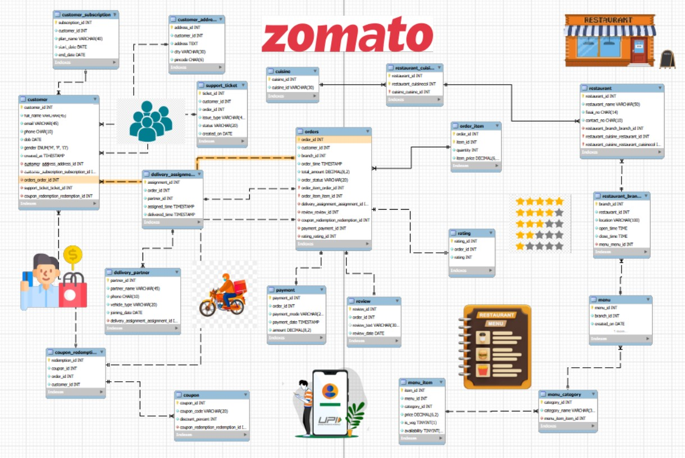

# ZOMATO Database Design
This project is a Database Management System (DBMS) design for the real-world food delivery platform Zomato. The database models core operations such as customer management, restaurant and menu handling, order processing, payments, delivery assignments, and feedback.

The project includes 20+ entities with well-defined attributes, primary keys, foreign keys, and constraints to maintain data integrity. All 1:1, 1:N, and M:N relationships are implemented, with junction tables used wherever required.

Careful attention has been given to data type selection, normalization, and constraint enforcement (NOT NULL, UNIQUE, CHECK). The database schema was designed using MySQL Workbench EER diagrams and converted into SQL code using forward engineering.

This project was created purely for academic purposes as part of the DBMS course to demonstrate practical understanding of relational database design.
